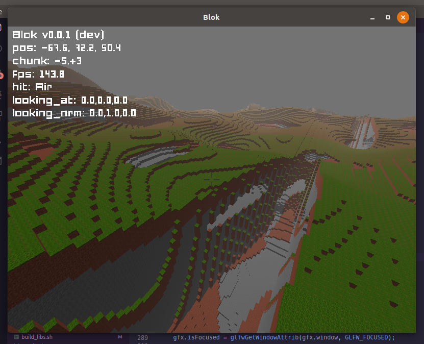

# Blok

Blok is a simple 3D block-based game (similar to Minecraft) that is meant to be extensible, performant, and fun to play!

I wrote the entire project from scratch, only using a handful of I/O & platform-abstracting layers. The math, shaders, algorithms, gameplay, audio, video, textures, etc I made myself (except for some 3D meshes I use to test the rendering engine, but those aren't included in the final product anyway)

TODO: I plan to add a wiki with actual gameplay information, once it gets to that state

See the source code in the `Blok/` folder if you want to learn more about the algorithms!

For textures/objects/effects/fonts see the `assets/` folder

## Building On Linux/Unix

## Dependencies
`
`Blok` requires the programs: cmake (>=3.1), make, `g++/c++`

`Blok` requires the libraries: glfw3*, assimp*, portaudio*, freetype*, and OpenGL. ("*" indicates that the dependency can be built locally & statically). So, as long as you have OpenGL headers

`sudo apt install org-dev libglu1-mesa-dev libvorbis-dev libjack-dev libasound2-dev`

## Compiling

First, run `./build_libs.sh` this will build glfw3, assimp, portaudio, freetype, and their dependencies as static libraries

Then, `cd build`, and run `cmake ..` ensure there were no errors

If successful, run `make -j8` to create the executable `Blok/Blok`. To test it out run:

`./Blok/Blok`, and the game should start up!

If you can't get a video output, run `./Blok/Blok -h` for help/usage/info etc

## Building On MacOS

For now, try following the above instructions for Linux/Unix. If you have any problems, email me: brown.cade@gmail.com , as I don't have  MacOS machine I can test on, so help for building the program would be much appreciated!

## Building On Windows

TODO: I have a dual boot system, and I almost got it working, except I messed up setting up linking flags for the Windows compiler. It should be possible to build for windows, but I need to expirement and try it more

# Other Screenshots

